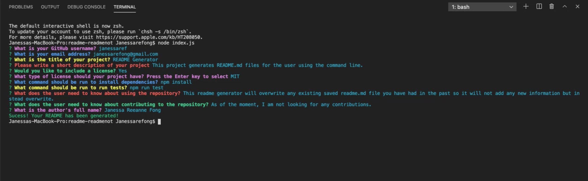

# README Generator (README, README NOT)

In this project, I’ve created a README generator that is going to write a README.md file for the user using node. This is meant to be an easy way to put together a README.md file for new projects wherein the user can spend more time on the project and less time on creating a good README. With the command line open, the user will run a command "node index.js" or in this case, whatever the file was named and then will be asked a series of questions. The user will just put in their inputs and once that is done, the README.md file will be generated and will include all of the user's inputs. One thing the user needs to note is that if the user plans to run "node index.js" again, any previously saved content in the README.md file will be overwritten. The user has to be sure about the changes that will be made. If the user decides to leave any blank answers in the prompted questions, it will print "N/A" on the file on its respective sections. To know more on how to use this, a demo link is available below at the [Usage](#usage) section.

The following sections are included in this README generator:

  * Title 
  * Description
  * Table of Contents
  * Installation
  * Usage
  * License
  * Contributing
  * Tests
  * Author (name, GitHub username, email and avatar)
  * Questions
  * Badge specific to the repository

In this project, this uses inquirer which allows me to create the questions to be prompted to the user. For the user's information as well, the colorful questions that were prompted, I used the command "npm install chalk" for that. To see the expected output of this README generator, you can check out the folder "output" that contains the sample. You can also find more information below on installation, usage, demo/videos, snippets and images.

## Table of Contents

* [Technologies Used](#technologies-used)
* [Installing](#installing)
* [Usage](#usage)
* [GIF of Project](#gif-of-project)
* [Image of Project](#image-of-project)
* [Code Snippet](#code-snippet)
* [Author](#author)
* [License](#license)
* [Acknowledgments](#acknowledgments)

## Technologies Used

* [Node.js](https://nodejs.org/en/)
* [Javascript](https://developer.mozilla.org/en-US/docs/Web/JavaScript)
* [Inquirer](https://www.npmjs.com/package/inquirer)
* [Chalk](https://www.npmjs.com/package/chalk)

## Installing
  
  Step-by-step guide on how to install this README Generator:
  - start by cloning down this respository by clicking on the green button "code" on the top right corner of the main content and copying/saving to clipboard the https url.
  - in your command line, choose a folder destination on your computer and write the command "git clone [paste url link]" 
  - open the folder in VS Code
  - open your command line in your VS Code or the command line application you have installed on your device (be sure you're at the right folder containing the content and you can check this by using the command "ls" and/or "pwd")
  - use the command "npm install" (this downloads the dependencies available inside the package.json file)
    - you should see a node_modules folder
  - use the command "npm install chalk" for the colorful prompted questions
  - once installations are done, you can run the command "node index.js" to begin the questions

## Usage

  To see how this README Generator works using node, see the demo available at the link below (view-only):

  https://drive.google.com/drive/folders/1mMq1RdgA86YWJvYhJ1OFtg4Onp9wh9wi?usp=sharing

## GIF of Project


## Image of Project

Attached below is a screenshot of the prompt questions. I did use the command "npm install chalk" to give the colorful questions.



## Code Snippet

In this code snippet, this contains the questions prompted to the user confirming if the user would like to include a license, if yes, then the next question will be prompted with a list of licenses otherwise, the question will be skipped and in the actual README file, it will print "N/A" under license. This is using the when function in the inquirer that allows it to run this way.

```
 {
        type: "confirm",
        name: "license",
        message: chalk.green("Would you like to include a license?"),
    },
    { // list of licenses will only be prompted if the user confirms license to be included
        when: function(data) {
            if (data.license) {
                return true;
            } else {
                return false;
            }
        },
        type: "list",
        name: "badge",
        message: chalk.magenta("What type of license should your project have? Press the Enter key to select"),
        choices: ["MIT", "Apache 2.0", "GPL 3.0", "BSD 3"],
    },
```

## Author

* Janessa Reeanne Fong

- [Link to Github](https://github.com/janessaref)
- [Link to LinkedIn](https://www.linkedin.com/in/janessafong)

## License

This project is licensed under the MIT License 

## Acknowledgments

* I'd like to acknowledge my tutor Andrew Knapp.
* To my mentors and instructors, Roger Lee, Kerwin Hy, and Manuel Nunes for helping and teaching me throughout this program.
